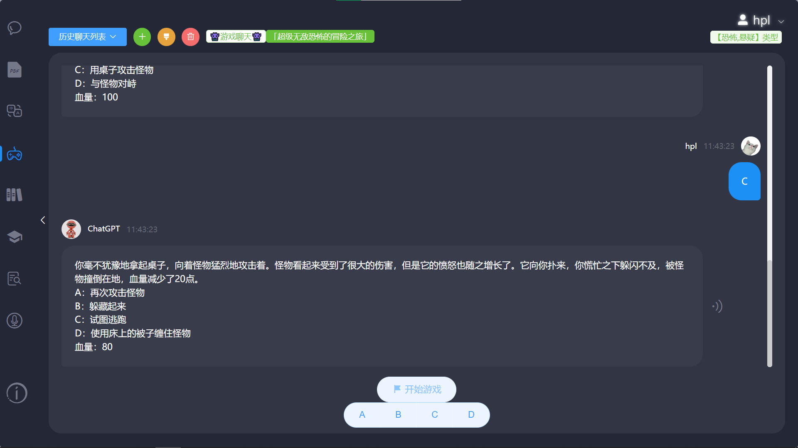
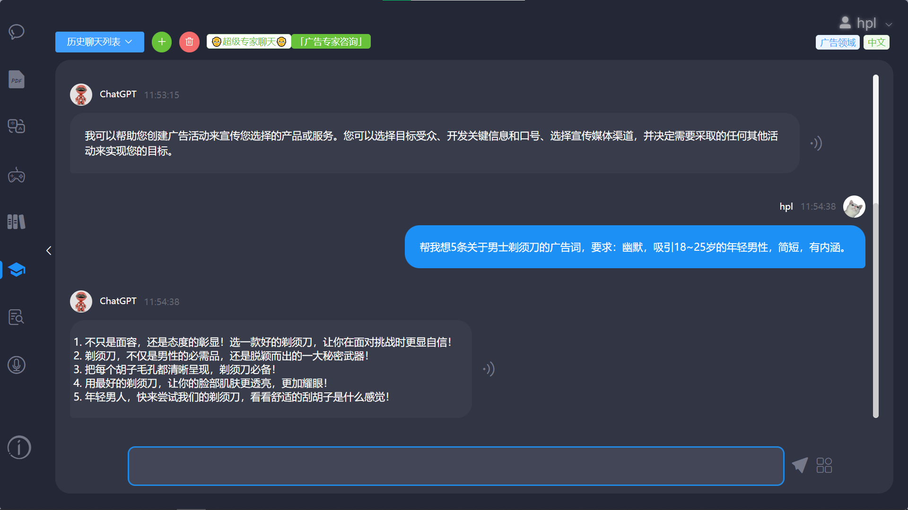

# 🚀 FunAi - Based on ChatGPT and SpringBoot

## 📖 简介

- 欢迎来到FunAi的后端仓库，我们使用Java对了现有AGI进行二次开发。
- 目前是FunAi的第一个版本，已经接入ChatGPT和GPT-4实现一些有意思的应用，详细请见【项目亮点】 和 【功能展示】部分。
- 目前[FunAi网站](https://funai.vip/) 可免费使用😆，欢迎进入[FunAi](https://funai.vip/)网站一起玩耍吧~


## ➰ 项目亮点

✅ ChatGPT聊天

- 集成OpenAi API (ChatGPT3.5 + GPT4 + embedding)
- 支持markdown格式，代码高亮，代码复制，公式和图表展示
- 无限轮聊天 + 带上下文逻辑 （Guava Cache 优化响应时间）
- 流式输出 / 普通输出
- 多会话 + 记录存储 + 记录管理（新增/清空/删除）
- 数据导出
- 语音聊天 + 语音播放
- TODO: 接入文生图模型（MidJourney / Stable Diffusion Model）


✅ PDF智能阅读（论文 / 简历 / 知识文档等）

  - 接入OpenAI的Embedding API，使用Pinecone/Milvus向量库存储向量。

  - PDF解析 + 递归分词文段抽取 + 文本向量化 + 向量语义匹配 + 召回知识库相似文本匹配

  - 大文件上传（目前测试阶段暂时最多支持80页）

  - 多会话 + 文件保存 + 记录存储 + 记录管理（新增 / 删除） 


✅ 账号管理

- 游客登录（IP / 浏览器指纹）
- 登录注册（手机号 / 账号密码 / 微信TODO）
- API-Key管理（用户可上传自己的API-Key，不受限制。否则使用系统的API-Key，会根据用户等级不同设置当日聊天限制）
- 用户等级管理（普通用户、vip用户、管理员、游客）


✅ 文字冒险游戏

  - 多主题设置

  - 游戏记录存储 + 按键互动

  - TODO: AI生成场景描述图片 + 背景音乐 + 多游戏选择


✅ 提示库

  - 实时修改提示，动态影响系统相关内置功能

  - 全局多条件分页搜索

  - 提示库管理（权限管理 + 提示增删查改）


✅ 其它

- 轮询调度API-Key + 定时失效检测
- 异步优化请求响应时间
- 定时任务刷新缓存
- OpenAI多模型选择 + 参数自定义


✅ 智能简历 TODO

- 创建简历 -> 专业模板 -> 智能优化

- ChatGPT智能分析简历
- 根据简历内容进行对应的面试，模拟真实面试过程
- 支持多次面试
- 自定义模板导出


✅ 口语练习 TODO

  - 多种真人语音对话


## 🔰 快速开始

🎈第零步：科学上网（全局模式） 或 海外服务器

🎈第一步：MySQL导入funai.sql文件

🎈第二步：必配项目 （在项目中全局搜 TODO关键字找到必配条目）

- 配置application.properties
  - MySQL
  - Redis
  - 梦网云短信服务

- 配置向量库（二选一，推荐选Pinecone）

  - **Pinecone向量库（第三方）**

    1. 去Pinecone申请apikey

    2. 在`PineconeApi.java`中完善以下信息

       ```java
       private static final String PINECONE_API_URL = "https://xxxxxx.pinecone.io";
       ```

    3. 在MySQL数据库表admin_apikey中插入一条记录，type为4，name为Pinecone的apikey

  - Milvus向量库（本地搭建）

    1. 搭建Milvus

    2. 在`MilvusClientUtil.java`中完善以下信息

       ```java
       private static final MilvusServiceClient milvusClient = new MilvusServiceClient(
                   ConnectParam.newBuilder()
                           .withHost("xx.xx.xx.xx")
                           .withPort(19530)
                           .build());
       ```

       

🎈第三步：配置OpenAI的apikey

1. 创建OpenAI账号，申请apikey
2. 在MySQL数据库admin_apikey中插入一条记录，type为0，name为OpenAI的apikey


🎈第四步：启动 FunAiApplication  或  在测试类TestChatService中测试chatOneShot方法


## :zap: 技术栈

### 前端

请移步 [FunAi前端仓库](https://github.com/huangPengL/ChatGPT-Vue-FunAi) 

### 后端

- 主语言：Java（JDK 1.8）
- 开发框架：SpringBoot
- 数据库：MySQL 5.7、Pinecone、Milvus 2.2.5
- 中间件：Redis 7.0.11
- 对象存储： 阿里云OSS
- 第三方API：Openai-ChatGPT、Openai-Embedding、梦网云短信服务、百度语音识别

### 部署

- web 服务：Nginx
- 海外服务器\本地全局科学上网


## 🤖 功能展示

✅ ChatGPT聊天


  


✅ PDF智能阅读（论文 / 简历 / 知识文档等）  

  


✅ 文字冒险游戏


  

✅ 专家系统

  - 多领域（投资、广告、小说、计算机、诗歌、哲学、医学、心理学等） + 多语言（中、英、日、韩...等）



✅ 智能语言学家（更像人类的翻译官）


✅ 提示库


✅ 账号管理


✅ 模拟面试 （TODO）


✅ 口语练习 （TODO）


## 📄 License

FunAi is licensed under the MIT License. See the [LICENSE](https://github.com/knuddelsgmbh/jtokkit/blob/main/LICENSE) file for more information.


